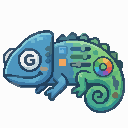

# Godot Chameleon UI
<!--suppress HtmlDeprecatedAttribute -->

An opinionated extension to the Godot UI components.
> Compatible with Godot Engine 4 or later.

## Installation
1. Download the repository
2. Copy the addons folder `addons/godot_chameleon_ui` into your Godot project's addons directory.
3. Enable the plugin in Godot, go to Project > Project Settings > Plugins and enable the plugin.

## Features
### Animations

- Focus Animation

### Components

- Box Container
- Button
- Checkbox
- Dialog Module
  - Dialog
- Dropdown (OptionButton)
- Label
- Margin Container
- Panel Container
- Slider
- TextureRect

### Controllers

- Debounce
- Splash Screen Controller
- Transition Controller
